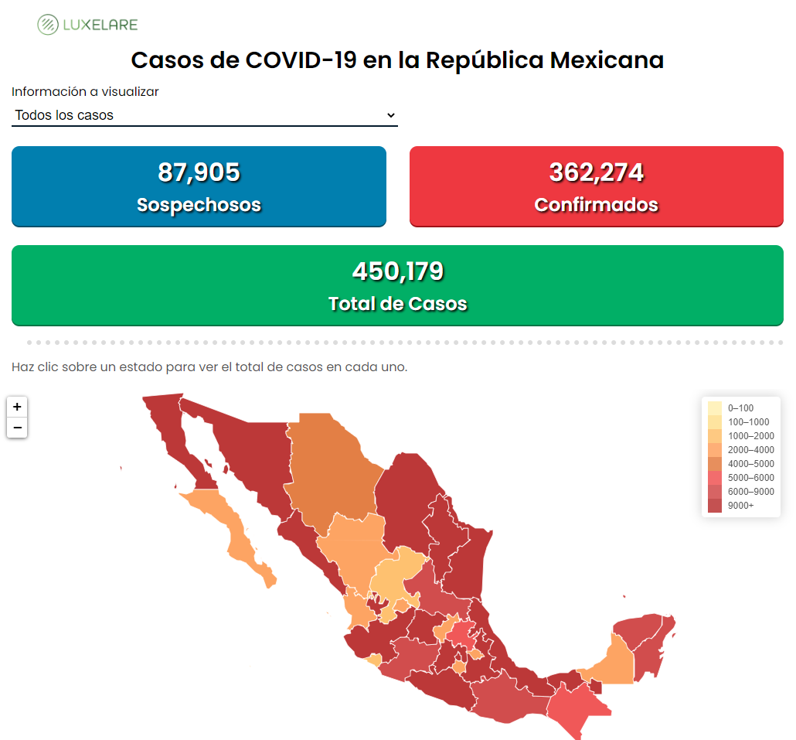
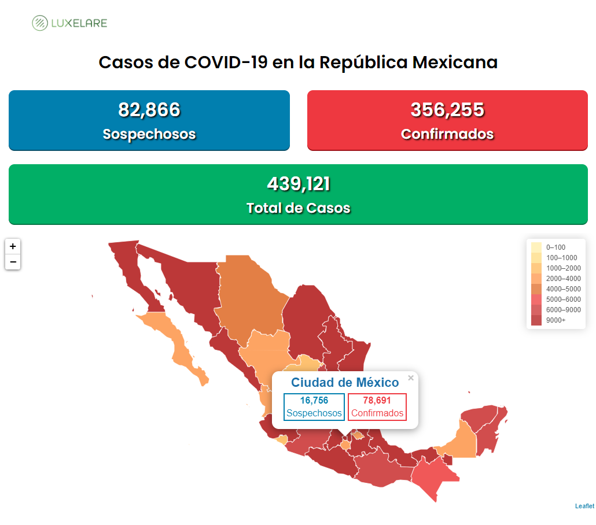
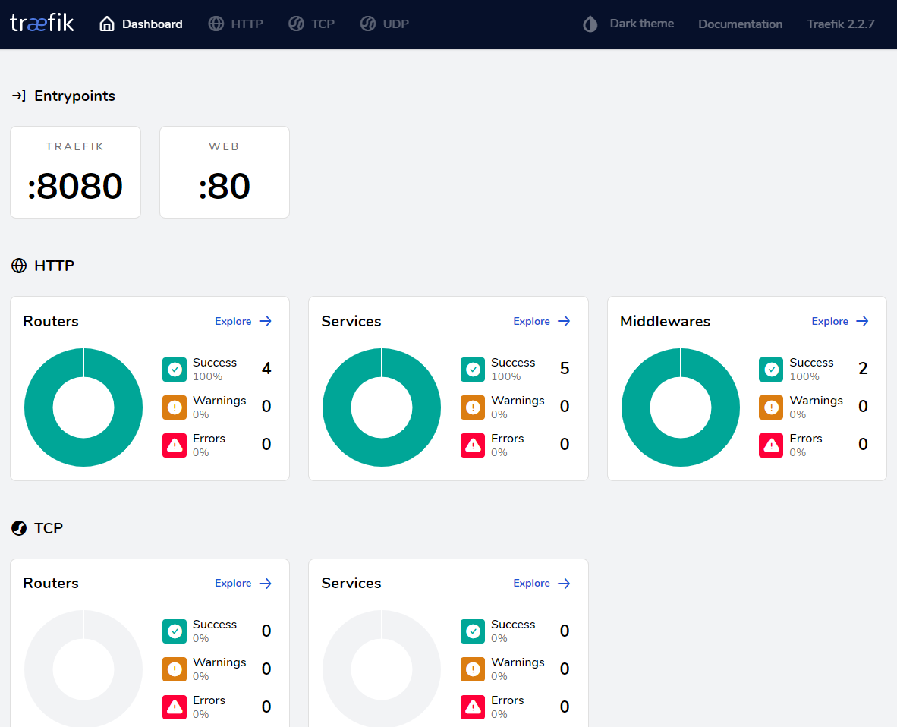
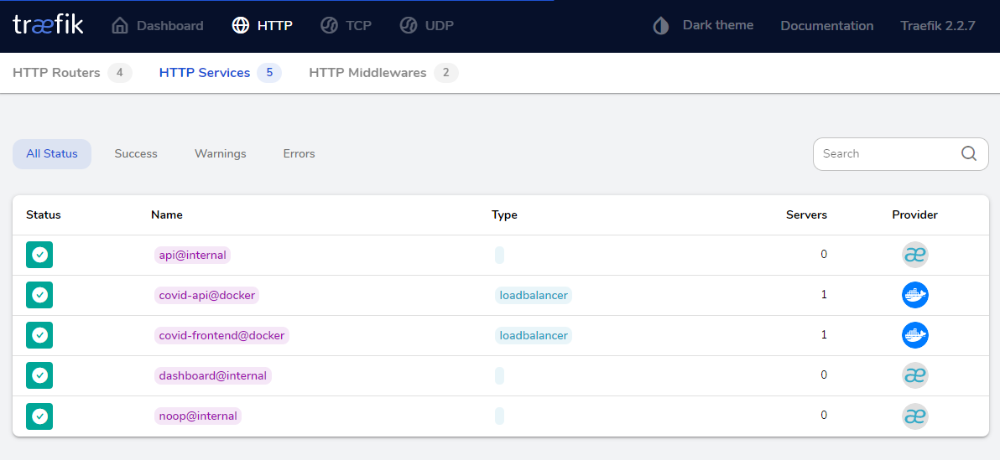

# COVID Map - Map to view COVID-19 cases on Mexico

Map to view COVID-19 cases on Mexico, developed with ReactJs.


### 🛠️ Installation

📌**Development Environment**

Require Docker

#### Creating Network
```
docker network create --attachable covidnet
```

#### Backend API
Creating Docker Image and running the container
```
docker build -t covid-api .
docker run --name covid-api --net=covidnet -it --rm -p 8000:8000 covid-api
```
>Run over the Server Folder inside the Backend Project

>Uncomment RUN echo "ALLOWED_HOSTS = ['*']" >> covid_api/settings.py

>This project runs on **http://localhost:8000**

#### Frontend
*For running local frontend with Hot Reloading
Require NodeJs
```
npm install
npm run dev
```
Create a **.env** file at root level following the example file (.env-example).
```
PORT=9000
NODE_ENV=development
API_URL=http://localhost:8000
```
>This project runs on **http://localhost:9000** or the specified **PORT** on the .env file.

*For running local frontend from the container
```
docker build -t covid-frontend .
docker run --name covid-frontend --net=covidnet --rm -p 9000:9000 covid-frontend
```


#### Reverse Proxy

*For running local proxy from the container
```
docker build -t covid-proxy .
docker run --name covid-proxy --net=covidnet --rm -p 5000:5000 covid-proxy
```
>Run over the nginx Folder inside the Frontend Project

>This project runs on **http://localhost:5000** and shows the frontend over **http://localhost:5000/app** and the backend api over **http://localhost:5000/api**


### 🖥 Execution

📌**Development as Production Environment**

#### Docker Compose
Creating cluster, network and running the containers
```
docker-compose up
```

>This project runs on **http://localhost:8080/** to see the traefik dashboard and shows the frontend over **http://localhost:5000/** and the backend api over **http://localhost:5000/api**

For stopping the services run:
```
docker-compose down
```

#### Docker Swarm
Creating cluster, network and running the containers
```
docker swarm init
docker network create --driver=overlay traefik-public
docker stack deploy -c docker-swarm.yml covid
```

>This project runs on **http://localhost:8080/** to see the traefik dashboard and shows the frontend over **http://localhost:5000/** and the backend api over **http://localhost:5000/api**

For stopping the cluster run:
```
docker swarm leave --force 
```

### 💻 Technologies

  * React
  * ESLint
  * Webpack
  * Traefik
  * Docker
  * Docker Swarm


### ✒️ Author

* **William Velazquez** - [WilliamVelazquez](https://williamvelazquez.com/)

If you want to know about the insights [click here!](https://github.com/WilliamVelazquez/covid-map/pulse/monthly)


📷 Screenshots








## 📄License

This project is licensed under the terms of the **MIT license**.


### 🎁 Contribute

Feel free to contribute to the project!
